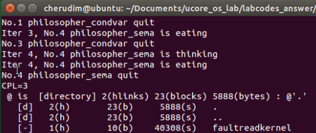
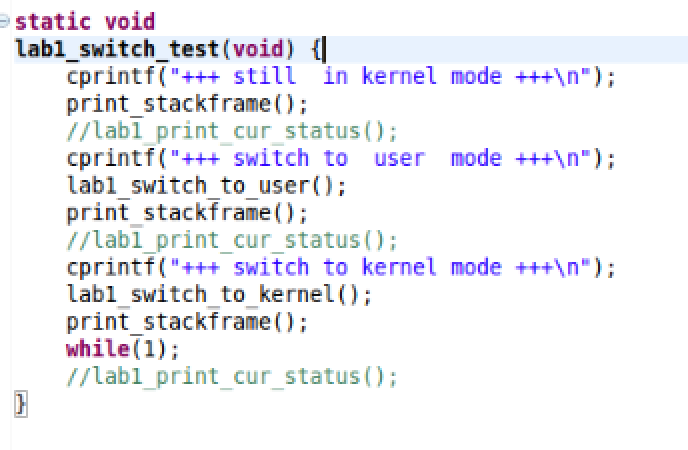
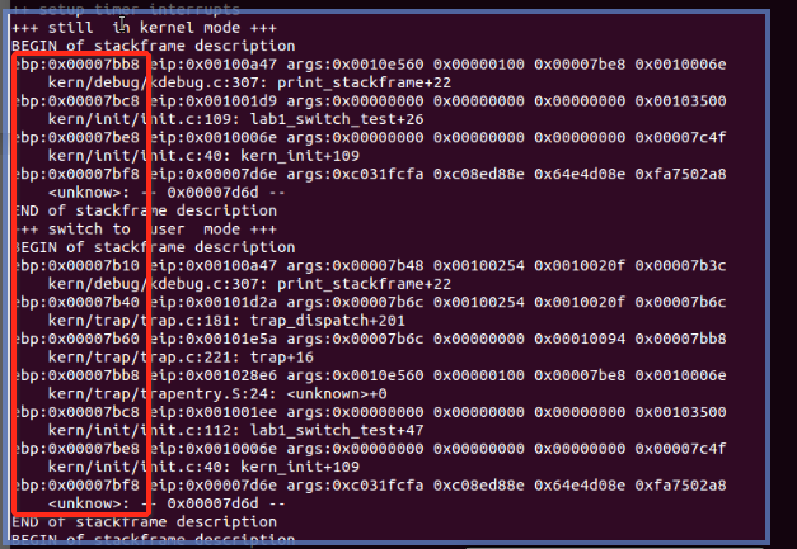
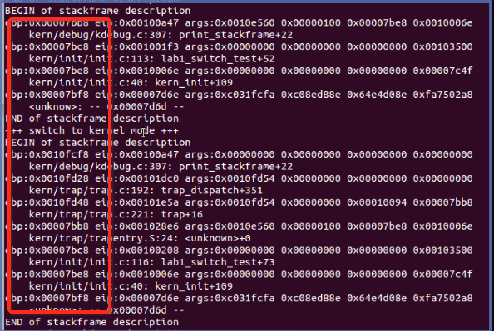

#02-2-lab1-spoc-discussion

##问题1

**问题**：描述符特权级DPL、当前特权级CPL和请求特权级RPL的含义是什么？在哪些寄存器中这些字段？对应的访问条件是什么？ (challenge)写出一些简单的小程序（c or asm）来体现这些特权级的区别和联系。

DPL:用于描述代码的所属的特权等级,也就是代码本身真正的特权级
存在描述符中的权限位

CPL:是当前进程的权限级别(Current Privilege Level)，是当前正在执行的代码所在的段的特权级.
存在cs寄存器的低两位。

RPL:说明的是进程对段访问的请求权限(Request Privilege Level)，是对于段选择子而言的，每个段选择子有自己的RPL，它说明的是进程对段访问的请求权限，有点像函数参数。而且RPL对每个段来说不是固定的，两次访问同一段时的RPL可以不同。RPL可能会削弱CPL的作用
存在选择子的最低两位。

访问时的特权检查是判断：EPL=max(RPL,CPL)<=DPL是否成立

##问题1 Challenge

修改内核程序，获取RPL

  int GETCPL() {
    int ret;
    asm volatile (
       "movl %%cs, %0\n"
       : "=r" (ret)
    );
    return ret;
  }

  void
  kern_init(){
    ...
    cprintf("CPL=%d\n", GETCPL()&3);
  }
  
输出为0.
  
修改用户程序，获取RPL。本小组选择了在`ls.c`中添加了输出语句（类似于上一程序）。得到结果如下：

输出为3.

##问题2

**问题**：比较不同特权级的中断切换时的堆栈变化差别；(challenge)写出一些简单的小程序（c or asm）来显示出不同特权级的的中断切换的堆栈变化情况。

**答案**：

当处在内核态的时候，中断时并不切换堆栈（即一直处在内核态中）；

当处在用户态的时候，中断时需要切换堆栈，即从用户堆栈切换到内核堆栈；中断处理完之后，再从内核堆栈切回用户堆栈。

实验程序如下：

修改ucore lab1的`init.c`文件中的`lab1_switch_test()`，如下：

当处在内核态中时，进入中断前&进入中断后的堆栈对比如下：

当处在用户态中时，进入中断前&进入中断后的堆栈对比如下：

