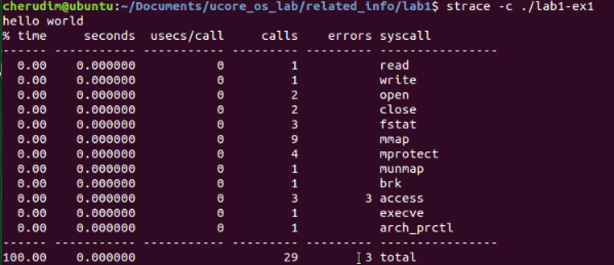
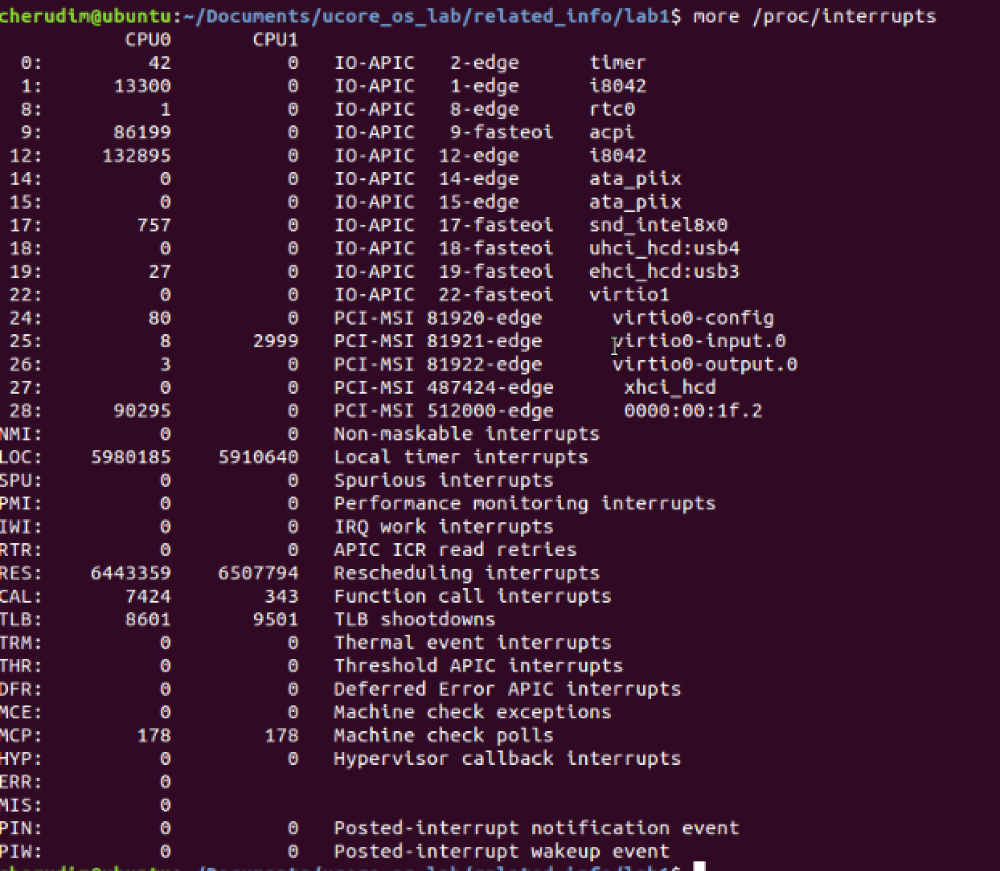

#3.5

##第一问

    3582  execve("./lab1-ex0.exe", ["./lab1-ex0.exe"], [/* 62 vars */]) = 0
    //int execve(const char *filename, char *const argv[],char *const envp[]);
    //execute program

    3582  brk(0)                            = 0x9f05000
    3582  access("/etc/ld.so.nohwcap", F_OK) = -1 ENOENT (No such file or directory)
    //access a file or directory

    3582  mmap2(NULL, 8192, PROT_READ|PROT_WRITE, MAP_PRIVATE|MAP_ANONYMOUS, -1, 0) = 0xb775c000
    //map files or devices into memory

    3582  access("/etc/ld.so.preload", R_OK) = -1 ENOENT (No such file or directory)
    3582  open("/etc/ld.so.cache", O_RDONLY|O_CLOEXEC) = 3
    //open() returns a file descriptor, a small, nonnegative integer for use in subsequent system calls

    3582  fstat64(3, {st_mode=S_IFREG|0644, st_size=81393, ...}) = 0
    //except that the file about which information is to be retrieved is specified by the file descriptor fd.return a stat structure

    3582  mmap2(NULL, 81393, PROT_READ, MAP_PRIVATE, 3, 0) = 0xb7748000
    3582  close(3)                          = 0

    3582  access("/etc/ld.so.nohwcap", F_OK) = -1 ENOENT (No such file or directory)
    3582  open("/lib/i386-linux-gnu/libc.so.6", O_RDONLY|O_CLOEXEC) = 3
    3582  read(3, "\177ELF\1\1\1\0\0\0\0\0\0\0\0\0\3\0\3\0\1\0\0\0\340\233\1\0004\0\0\0"..., 512) = 512
    //read lab1-ex0.exe

    3582  fstat64(3, {st_mode=S_IFREG|0755, st_size=1758972, ...}) = 0
    3582  mmap2(NULL, 1763964, PROT_READ|PROT_EXEC, MAP_PRIVATE|MAP_DENYWRITE, 3, 0) = 0xb7599000
    3582  mmap2(0xb7742000, 12288, PROT_READ|PROT_WRITE, MAP_PRIVATE|MAP_FIXED|MAP_DENYWRITE, 3, 0x1a9000) = 0xb7742000
    3582  mmap2(0xb7745000, 10876, PROT_READ|PROT_WRITE, MAP_PRIVATE|MAP_FIXED|MAP_ANONYMOUS, -1, 0) = 0xb7745000
    3582  close(3)                          = 0
    3582  mmap2(NULL, 4096, PROT_READ|PROT_WRITE, MAP_PRIVATE|MAP_ANONYMOUS, -1, 0) = 0xb7598000

    3582  set_thread_area({entry_number:-1 -> 6, base_addr:0xb7598940, limit:1048575, seg_32bit:1, contents:0, read_exec_only:0, limit_in_pages:1, seg_not_present:0, useable:1}) = 0
    //set_thread_area - set a GDT entry for thread-local storage

    3582  mprotect(0xb7742000, 8192, PROT_READ) = 0
    3582  mprotect(0x8049000, 4096, PROT_READ) = 0
    3582  mprotect(0xb777f000, 4096, PROT_READ) = 0
    //set protection on a region of memory

    3582  munmap(0xb7748000, 81393)         = 0
    //deletes the mappings for the specified address range, and causes further references to addresses within the range to generate invalid memory references.

    3582  write(1, "hello world\n", 12)     = 12
    //write to a file descriptor "ssize_t write(int fd, const void *buf, size_t count);"
    writes up to count bytes from the buffer pointed buf to the file referred to by the file descriptor fd.

    3582  exit_group(12)                    = ?
    // void exit_group(int status);
    // exit all threads in a process

    3582  +++ exited with 12 +++

objdump:反汇编
nm：
列出某些文件中的符号，一些函数和全局变量等
file： ELF 32-bit，识别文件类型，也可用来辨别一些文件的编码格式。它是通过查看文件的头部信息来获取文件类型
strace：用来跟踪进程执行时的系统调用和所接收的信号（**具体分析看上面的程序的注释**）

##第二问

执行`strace`后：

由此可见strace可用来跟踪进程执行时的系统调用的情况。 

由于进程不能直接访问硬件设备，当进程需要访问硬件设备(比如读取磁盘文件，接收网络数据等等)时，必须由用户态模式切换至内核态模式，通过系统调用访问硬件设备。strace可以跟踪到一个进程产生的系统调用,包括调用次数(Calls)，出错次数(errors)，执行消耗的时间（time, seconds）。

访问`/proc/interrupts`后，得到：

第一列是中断号，接着的每一列表示系统的每一CPU核处理了多少次该类中断，接着是中断的类型，最后一列是设备号。

中断类型中：

- IO-APIC, edge表示正边沿触发的中断；
- IO-APIC, fasteoi表示边沿触发的中断，并且只有当中断控制器(PIC)发出中断处理的ack之后，才会取消继续触发中断；
- PCI-MSI，PCIe设备发出MSI报文产生中断。